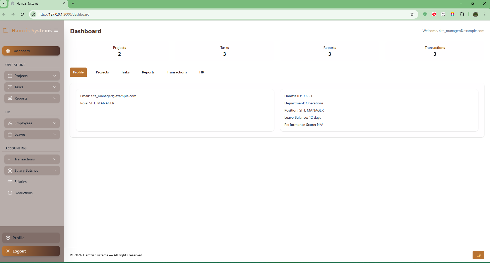

# Earmark Systems

**Earmark Systems** is a comprehensive project management and business administration application designed to streamline workflows, manage projects, track tasks, and handle internal resources like human resources and financial transactions.



_A screenshot of the main application dashboard._

## Table of Contents

- [Overview](#overview)
- [Features](#features)
- [Documentation](#documentation)
- [Technology Stack](#technology-stack)
- [Setup and Installation](#setup-and-installation)
- [Usage](#usage)
- [Running Tests](#running-tests)
- [Deployment](#deployment)
- [Contributing](#contributing)
- [License](#license)
- [Contact](#contact)

## Overview

This application provides a centralized platform for managing core business operations. It is built with a modern, robust, and scalable technology stack, making it suitable for small to medium-sized teams. The system is designed with clear user roles and permissions, ensuring data security and integrity.

## Features

- **User Authentication & Authorization:** Secure user management powered by **Devise** for authentication and **Pundit** for role-based authorization. User registration is restricted, with administrators responsible for creating and managing accounts.

- **Modular Architecture:** The application is organized into logical modules (**HR**, **Accounting**) using namespacing, ensuring a clean and scalable codebase.

- **Project Management:**
  - **Project Tracking:** Create, manage, and monitor projects, including setting budgets, tracking progress, and assigning project managers.
  - **Task Management:** Define tasks within projects, assign them to users, and track their status from "To Do" to "Done."

- **Reporting & Analytics:**
  - **Project Reporting System:** A structured workflow for creating, submitting, and reviewing project reports, enabling transparent progress tracking.
  - **Dashboard:** A central dashboard provides a high-level overview of ongoing projects, pending tasks, and other key metrics.

- **Human Resources (HR) Module:**
  - **Employee Management:** Maintain a directory of employees and manage organizational structure (e.g., manager-subordinate relationships).
  - **Leave Management System:** A complete workflow for employees to request time off and for managers to approve or deny requests.
  - **Personal Details:** Store comprehensive personal and banking information for payroll and HR purposes.

- **Accounting Module:**
  - **Transaction Logging:** Record financial transactions related to the organization.
  - **Salary Management:** Manage employee salaries, batches, and deductions (taxes, pension, insurance, etc.).

- **Inventory Module:**
  - **Inventory Items Master:** Maintain master data for all inventory items with SKU, unit cost, and status tracking.
  - **Warehouse Management:** Manage multiple warehouse locations for inventory storage.
  - **Stock Level Tracking:** Real-time tracking of inventory quantities across warehouses.
  - **Stock Movements Audit Trail:** Complete history of all inventory movements (inbound, outbound, adjustments, allocations) with references to employees, projects, and tasks.
  - **Project Inventory Allocation:** Reserve and allocate inventory items to specific projects for work tracking.

- **Project Expense Tracking:**
  - Record and track expenses for individual projects to monitor budget utilization.

## Project Structure

The application follows the standard Ruby on Rails directory structure. Key directories include:

- **`app/`**: Contains the core application code, organized by functionality:
  - **`controllers/`**: Handles incoming HTTP requests and coordinates with models and views. Namespaced controllers for `Accounting`, `HR`, `Inventory`, and `Dashboard`.
  - **`models/`**: Defines the application's data models and business logic. Namespaced models for `Accounting`, `HR`, and `Inventory`.
  - **`views/`**: Contains the ERB templates for rendering the user interface.
  - **`javascript/`**: Frontend JavaScript code, managed by **Hotwire** (Stimulus controllers).
  - **`assets/`**: Static assets like images and stylesheets.
  - **`jobs/`**, **`mailers/`**, **`policies/`**: Application components for background jobs, email notifications, and authorization policies.

- **`config/`**: Application configuration files, including `routes.rb` for routing, `database.yml` for database settings, and initializers.

- **`db/`**: Database-related files, including the schema (`schema.rb`) and migrations.

- **`docs/`**: A dedicated directory for detailed documentation on architecture, features, and APIs.

## Technology Stack

This project is built with a modern Rails 8 stack:

- **Backend:** Ruby on Rails 8.0.4
- **Database:** PostgreSQL
- **Authentication:** Devise
- **Authorization:** Pundit
- **Frontend:** Hotwire (Turbo & Stimulus), Tailwind CSS
- **Background Jobs:** Solid Queue
- **Caching:** Solid Cache
- **Websockets:** Solid Cable
- **Testing:** RSpec, Factory Bot, Faker, Capybara
- **Linting:** RuboCop (with `rubocop-rails-omakase`)
- **Deployment:** Kamal

## Setup and Installation

Follow these steps to get the application running locally.

### Prerequisites

- Ruby 3.3.0 or later
- Node.js & Yarn
- PostgreSQL

### Installation Steps

1.  **Clone the repository:**

    ```bash
    git clone https://github.com/your-username/hamzis_systems.git
    cd hamzis_systems
    ```

2.  **Install dependencies:**

    ```bash
    bundle install
    npm install
    ```

3.  **Set up the database:**
    Make sure your `config/database.yml` is configured correctly for your local PostgreSQL instance. Then run:

    ```bash
    rails db:create
    rails db:migrate
    rails db:seed # Optional: if you have seed data
    ```

4.  **Run the application:**
    ```bash
    bin/dev
    ```
    The application will be available at `http://localhost:3000`.

## Development

This section provides guidelines for developers contributing to the project.

### Running Tests

To ensure code quality and stability, run the full test suite:

```bash
bundle exec rspec
```

### Code Style & Linting

This project uses **RuboCop** with the `rubocop-rails-omakase` configuration to enforce a consistent code style. Before committing, run the linter to check for violations:

```bash
bundle exec rubocop
```

For auto-correcting offenses, run:

```bash
bundle exec rubocop -A
```

### Security Scanning

Use **Brakeman** to scan the application for potential security vulnerabilities:

```bash
bundle exec brakeman
```

## Deployment

This application is configured for deployment using [Kamal](https://kamal-deploy.org/). The deployment configuration is located in `config/deploy.yml`.

To deploy the application, ensure you have access to the target server and run:

```bash
kamal deploy
```

## Contributing

Contributions are welcome! Please read our [CONTRIBUTING.md](./CONTRIBUTING.md) for details on our code of conduct and the process for submitting pull requests.

## License

This project is licensed under the MIT License - see the [LICENSE](LICENSE) file for details.

## Contact

Abdullahi Yusuf - adyusuf68@gmail.com

Project Link: [http://hamzis-systems-staging.onrender.com/](http://hamzis-systems-staging.onrender.com/)
